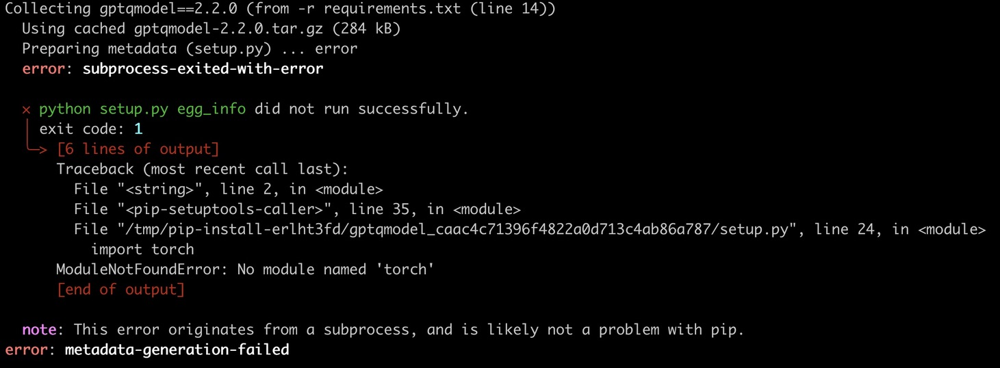

# EdgeAI_Final_Project
 NYCU 2025 Edge AI Final Project: Accelerating LLaMA 3.2B Inference on T4 GPU

## Environment Setup

1. Build and activate python-venv environment
```bash
sudo apt-get update
sudo apt install python3-dev python3-venv
pip install -U setuptools
python3 -m venv t30
source t30/bin/activate
```
2. Install python packages
```bash
pip install -r requirements.txt
```

## Usage

### Inference with finetuned and quantized LLM model
```bash
python3 inference.py
```

### Finetune LLM model
```bash
python3 finetune.py
```

### Quantize LLM model
```bash
python3 quantization.py
```

## Troubleshooting

When running pip install -r requirements.txt, you may occasionally encounter a ModuleNotFoundError: No module named 'torch' error for certain packages (even though torch is listed in the requirements.txt file)


If this happens, please run the following command to install the torch package separately, and then reinstall the remaining packages:
```bash
pip install torch==2.7.0
pip install -r requirements.txt
```